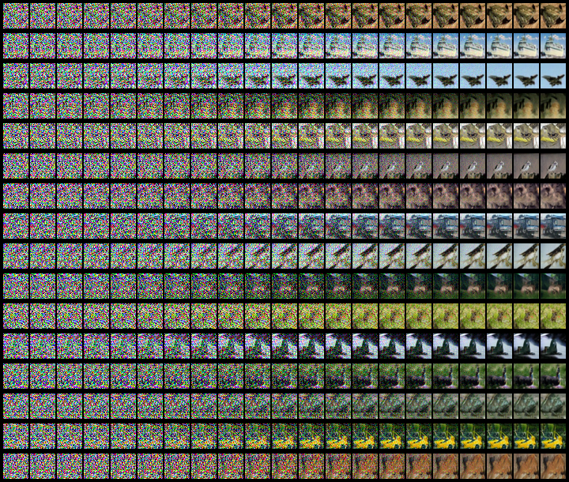

# Modelos Implícitos de Difusão para Remoção de Ruído (DDIM)

Esta é uma implementação em PyTorch do DDIM, baseada no artigo original disponível em: [https://arxiv.org/abs/2010.02502](https://arxiv.org/abs/2010.02502)

## Guia de Uso

### Configuração e Treinamento
1. Todos os parâmetros configuráveis estão no arquivo `config.yml`
2. Ajuste os parâmetros conforme necessário
3. Execute `train.py` para iniciar o treinamento

### Geração de Imagens
Execute `generate.py` com os seguintes parâmetros:

**Parâmetros Principais:**
- `-cp`: Caminho do checkpoint
- `--sampler`: Método de amostragem ('ddpm' ou 'ddim')
- `-bs`: Número de imagens geradas simultaneamente (padrão: 16)
- `--steps`: Passos de amostragem DDIM (padrão: 100)

**Parâmetros de Visualização:**
- `--result_only`: Mostrar apenas resultados finais (padrão: False)
- `--interval`: Intervalo entre imagens extraídas (padrão: 50)
- `--nrow`: Imagens por linha na exibição (padrão: 4)
- `--show`: Exibir a imagem resultante (padrão: False)
- `-sp`: Caminho para salvar a imagem

**Parâmetros Técnicos:**
- `--device`: Dispositivo usado ('cuda' ou 'cpu')
- `--eta`: Parâmetro η do DDIM (padrão: 0.0)
- `--method`: Método de amostragem ('linear' ou 'quadratic')
- `--to_grayscale`: Converter para escala de cinza (padrão: False)

## Exemplos Práticos


```bash
python generate.py -cp "checkpoint/cifar10.pth" -bs 16 --interval 10 --show -sp "data/result/cifar10_sampler.png" --sampler "ddim" --steps 200 --method "quadratic"


Example of generated image:


